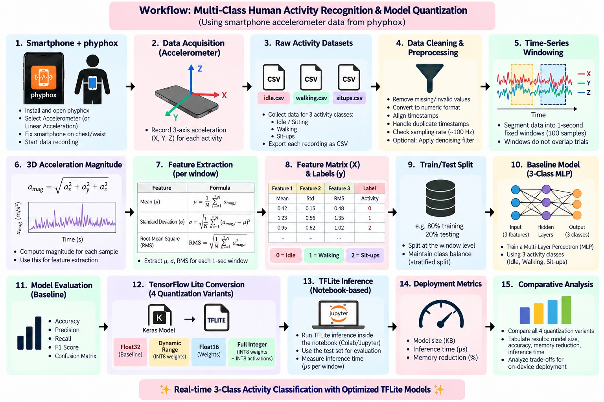

# TinyML Lab 2: Multi-Class Human Activity Recognition & Model Quantization Scheme Analysis

## Overview
This repository contains the implementation for **Lab 2** of the TinyML laboratory course (branch `Lab-2`).

The project performs **3-class Human Activity Recognition (HAR)** using tri-axial smartphone accelerometer data (`ax`, `ay`, `az`) recorded with the **phyphox** application. The activities are:

| Class label | Activity |
|:---:|---|
| 0 | Idle |
| 1 | Walking |
| 2 | Sit-ups |

Raw accelerometer recordings are resampled to 100 Hz, segmented into 1-second windows, reduced to three statistical features of the 3D acceleration magnitude, and classified by a compact **Multi-Layer Perceptron (MLP)** built in TensorFlow/Keras. The trained model is converted into **four TensorFlow Lite variants** (Float32, Dynamic Range, Float16, Full Integer INT8) and benchmarked on model size, accuracy, size-based memory reduction and per-window inference time, to study the trade-offs between quantization scheme, accuracy, size and latency.

All TFLite evaluation is performed with the TensorFlow Lite interpreter **inside the notebook**. No physical microcontroller or smartphone deployment is performed.

---

## Lab Objectives
1. **Sensor data acquisition:** record tri-axial accelerometer data for Idle, Walking and Sit-ups with a smartphone and phyphox.
2. **Data loading and cleaning:** load the three CSV recordings, detect the columns, remove invalid rows, sort by timestamp and estimate the sampling rate.
3. **Resampling and windowing:** resample each recording to a uniform 100 Hz grid and segment it into non-overlapping 1-second (100-sample) windows.
4. **3D acceleration magnitude:** compute $|a| = \sqrt{a_x^2 + a_y^2 + a_z^2}$ for every sample.
5. **Statistical feature extraction:** compute Mean, Standard Deviation and RMS of the magnitude for each window.
6. **Model training:** train a small 3-class MLP on the extracted features using a stratified train/test split.
7. **Baseline evaluation:** evaluate the Float32 Keras model on the held-out test set (accuracy, precision, recall, F1, confusion matrix).
8. **TFLite conversion with four quantization schemes:** Float32, Dynamic Range, Float16 and Full Integer INT8 (with representative-dataset calibration).
9. **Notebook-based benchmarking:** run all four TFLite models on the same test set and measure size, accuracy, memory reduction and average inference time per window.
10. **Comparative analysis:** discuss the observed quantization trade-offs for this model.

---

## System Architecture & Workflow



Sequence implemented in the notebook:

```
Smartphone + phyphox
        ↓
Tri-axial accelerometer (ax, ay, az)
        ↓
Raw CSV recordings (idle.csv, walking.csv, situps.csv)
        ↓
Data loading, cleaning, sampling-rate estimation
        ↓
Resampling to 100 Hz (linear interpolation on real timestamps)
        ↓
Non-overlapping 1-second windows (100 samples)
        ↓
3D acceleration magnitude
        ↓
Statistical features: mean, std, RMS
        ↓
Feature matrix X (567 × 3) and labels y
        ↓
Stratified 80/20 train/test split
        ↓
MLP classifier (3 → 16 → 8 → 3)
        ↓
Float32 baseline evaluation
        ↓
TFLite conversion
   ├── Float32
   ├── Dynamic Range Quantization
   ├── Float16 Quantization
   └── Full Integer (INT8) Quantization
        ↓
TFLite interpreter inference on the same test set
        ↓
Benchmarking: size, accuracy, memory reduction, latency
        ↓
Quantization trade-off analysis
```

---

## Detailed Pipeline

### Step 1: Sensor Data Acquisition
The smartphone accelerometer is recorded with phyphox, with the phone fixed at the chest or waist in a consistent orientation. Each activity (Idle, Walking, Sit-ups) is recorded separately and exported as one CSV file. The exported files contain linear-acceleration columns for the X, Y and Z axes.

### Step 2: Data Preprocessing
For each recording the notebook detects the time and `ax`/`ay`/`az` columns, converts them to numeric, drops missing or invalid rows, drops duplicate timestamps, sorts by time and estimates the sampling rate from the median sampling interval. No rows were removed from any of the three recordings; only the unused columns were dropped.

### Step 3: Resampling and Windowing
The recordings have a native rate of about **125 Hz** (estimated 124.96 / 124.97 / 125.00 Hz), not the 100 Hz targeted in the experiment, so 100 raw samples would span only about 0.8 s. Each recording is therefore **resampled to a uniform 100 Hz grid** by linear interpolation on its real timestamps. Each resampled recording is then split into **non-overlapping, 1-second windows of 100 samples** (no overlap). Only complete windows are kept, and trailing samples that do not fill a window are discarded and never padded.

### Step 4: 3D Acceleration Magnitude
For every sample the magnitude uses all three axes (Z is not discarded):

$$|a| = \sqrt{a_x^2 + a_y^2 + a_z^2}$$

This collapses the three axes into one orientation-independent signal that describes overall movement intensity.

### Step 5: Statistical Feature Extraction
Exactly three features are computed per window from the magnitude signal (see [Feature Engineering](#feature-engineering)). No other features are used.

### Step 6: Feature Matrix and Labels
The features form the matrix $X = [\text{mean},\ \text{std},\ \text{rms}]$ with shape **(567, 3)**, and each window receives its activity label (0 = Idle, 1 = Walking, 2 = Sit-ups).

### Step 7: Train/Test Split
`train_test_split` with `test_size = 0.20`, `random_state = 42` and `stratify = y`. The split is performed at the **window level, after feature extraction**.

### Step 8: MLP Training
A small MLP is trained on the training split (see [Model Architecture](#model-architecture)).

---

## Dataset Description
Three continuous phyphox recordings, one per activity:

| File | Activity | Raw samples | Native rate | Samples at 100 Hz | Complete 1 s windows | Discarded samples |
|---|---|---:|---:|---:|---:|---:|
| `idle.csv` | Idle (stationary) | 22,795 | ≈124.96 Hz | 18,243 | 182 | 43 |
| `walking.csv` | Continuous walking | 23,998 | ≈124.97 Hz | 19,204 | 192 | 4 |
| `situps.csv` | Repetitive sit-ups | 24,178 | ≈125.00 Hz | 19,343 | 193 | 43 |

Each file contains `Time (s)`, `Linear Acceleration x/y/z (m/s^2)` and `Absolute acceleration (m/s^2)`. The pipeline uses time, X, Y and Z only. The provided absolute-acceleration column is not used; magnitude is recomputed from the three axes.

**Class distribution (567 windows):**

| Split | Idle | Walking | Sit-ups | Total |
|---|---:|---:|---:|---:|
| All windows | 182 | 192 | 193 | 567 |
| Training | 146 | 153 | 154 | 453 |
| Test | 36 | 39 | 39 | 114 |

The classes are close to balanced.

---

## Feature Engineering
For a window of $N = 100$ magnitude samples $a_i$:

| Feature | Definition |
|---|---|
| **Mean** | $\mu = \frac{1}{N}\sum_{i=1}^{N} a_i$ |
| **Standard deviation** | $\sigma = \sqrt{\frac{1}{N}\sum_{i=1}^{N}(a_i-\mu)^2}$ |
| **RMS** | $\mathrm{RMS} = \sqrt{\frac{1}{N}\sum_{i=1}^{N} a_i^2}$ |

Mean captures the overall motion level, standard deviation captures how much the motion varies within the second, and RMS captures signal energy. The resulting input vector is `[mean, std, rms]` (feature matrix dtype `float32`).

---

## Model Architecture
The baseline classifier is a compact Keras MLP (`HAR_Baseline_MLP`):

```
Input(3)  [mean, std, rms]
  → Dense(16, ReLU)
  → Dense(8, ReLU)
  → Dense(3, Softmax)
```

| Item | Value |
|---|---|
| Total parameters | 227 (64 + 136 + 27), all trainable |
| Optimizer | Adam, learning rate 1e-3 |
| Loss | `sparse_categorical_crossentropy` |
| Epochs / batch size | 60 / 16 |
| Validation | `validation_split = 0.2` carved out of the training set; the test set is not used during training |
| Random seed | 42 (NumPy and TensorFlow) |

The softmax output layer with one unit per class and sparse categorical cross-entropy (integer labels 0, 1, 2) matches this 3-class setting.

---

## Baseline Model Evaluation
The Float32 Keras model is evaluated on the held-out test set (114 windows: 36 Idle, 39 Walking, 39 Sit-ups):

| Metric | Value |
|---|---:|
| Test accuracy | 85.09% |
| Test loss | 0.3190 |
| Precision (weighted) | 0.8515 |
| Recall (weighted) | 0.8509 |
| F1-score (weighted) | 0.8493 |

**Per-class classification report:**

| Class | Precision | Recall | F1-score | Support |
|---|---:|---:|---:|---:|
| Idle | 0.97 | 1.00 | 0.99 | 36 |
| Walking | 0.82 | 0.72 | 0.77 | 39 |
| Sit-ups | 0.77 | 0.85 | 0.80 | 39 |

Idle is separated almost perfectly, while most errors occur between Walking and Sit-ups. The notebook also plots the confusion matrix. Precision, recall, F1 and the classification report are computed for the Float32 Keras baseline only; the four TFLite models are compared by accuracy on the same test set.

---

## TensorFlow Lite Quantization Schemes
All four variants are converted from the same trained Keras model with `tf.lite.TFLiteConverter.from_keras_model`.

### 1. Float32 Baseline
Direct conversion with no optimization. Weights and activations remain Float32. This is the reference for size and accuracy comparisons.

### 2. Dynamic Range Quantization
`converter.optimizations = [tf.lite.Optimize.DEFAULT]` with no representative dataset. Weights are quantized to 8-bit integers, while activations remain in floating point and are computed dynamically at inference time. Input and output stay `float32`.

### 3. Float16 Quantization
`Optimize.DEFAULT` with `target_spec.supported_types = [tf.float16]`. Weights are stored in 16-bit floating point. Inputs and outputs stay `float32`, and, depending on the runtime/hardware, computation may still be carried out in floating point.

### 4. Full Integer (INT8) Post-Training Quantization
```python
converter.optimizations = [tf.lite.Optimize.DEFAULT]
converter.representative_dataset = representative_dataset
converter.target_spec.supported_ops = [tf.lite.OpsSet.TFLITE_BUILTINS_INT8]
converter.inference_input_type = tf.int8
converter.inference_output_type = tf.int8
```
- **Weights and activations** are quantized to 8-bit integers.
- **Calibration:** `representative_dataset()` yields the **training** feature samples (all 453 rows of `X_train`, one at a time) so the converter can observe activation ranges and compute int8 scales and zero-points. Test data are not used for calibration.
- **Input/output tensors** are `int8`. The inference helper reads each model's input dtype and quantization parameters, quantizes the float features into the integer domain, and dequantizes the output before taking the arg-max class.

---

## Model Artifacts

| File | Description |
|---|---|
| `model_float32.tflite` | Unquantized 32-bit floating-point TFLite model (reference) |
| `model_dynamic_range.tflite` | Post-training dynamic range quantization (8-bit weights, float activations) |
| `model_float16.tflite` | Float16 weight quantization |
| `model_int8.tflite` | Full integer INT8 post-training quantization (int8 weights, activations, input and output) |

These models are evaluated with the TensorFlow Lite interpreter inside the notebook to simulate edge-oriented execution. The notebook writes them to a `tflite_models/` directory.

---

## Quantization Comparison
Measured on the same 114-window test set (`results_df` in the notebook):

| Model | Model size (KB) | Accuracy (%) | Memory reduction vs Float32 (%) | Avg. inference time (µs/window) |
|---|---:|---:|---:|---:|
| Float32 Baseline | 3.023 | 85.09 | 0.00 | 2.33 |
| Dynamic Range | 3.023 | 85.09 | 0.00 | 1.47 |
| Float16 | 3.340 | 85.09 | −10.47 | 1.49 |
| Full Integer PTQ | 3.328 | 86.84 | −10.08 | 2.83 |

**Memory reduction** is the file-size reduction relative to the Float32 model. It is a proxy for storage (ROM) footprint, not runtime RAM, and negative values mean the file is larger than the Float32 file.

---

## Benchmarking Methodology
- **Model size:** actual `.tflite` file size on disk (`os.path.getsize`, in KB).
- **Accuracy:** computed on the same held-out test set for all four TFLite models.
- **Memory reduction:** $(1 - \text{size}/\text{size}_{\text{Float32}}) \times 100$.
- **Inference time:** `time.perf_counter()` around `interpreter.invoke()` only. The interpreter is created once (model loading excluded), preceded by **5 untimed warm-up inferences**, then the full test set is run **50 times** and the time is averaged over all single-window inferences, reported in **µs per window**. Input quantization and tensor read/write are outside the timed region.

---

## Results & Analysis
- **Accuracy:** Float32, Dynamic Range and Float16 give identical test accuracy (85.09%). The Full Integer PTQ model scored 86.84% (99 vs 97 correct out of 114 windows, i.e. two more windows). With a 114-window test set this difference is small and should not be read as quantization improving the model.
- **Model size:** for this very small network (227 parameters, about 3 KB), Dynamic Range quantization left the file size unchanged (3.023 KB), and Float16 (3.340 KB) and INT8 (3.328 KB) files were about 10% **larger** than Float32. The fixed TFLite file overhead (flatbuffer structure, quantization parameters) is comparable to the weight storage, so no size saving appears at this scale.
- **Latency:** all averages are in the low-microsecond range. Dynamic Range (1.47 µs) and Float16 (1.49 µs) were fastest here, Float32 took 2.33 µs, and INT8 was slowest at 2.83 µs. At this scale the timings are dominated by Python/interpreter call overhead on the notebook's CPU, and small differences may vary between runs and machines. They do not predict microcontroller performance.
- **Role of INT8:** it is the only variant with integer weights, activations and I/O, which is the representation relevant to integer-only, FPU-less microcontroller targets. This notebook does not demonstrate such hardware, and it showed no size or speed advantage for this model on the notebook CPU.

No single scheme is declared best: the observed trade-offs are small and specific to this tiny model and test set.

---

## Experimental Scope and Limitations
- **Small, limited dataset:** 567 one-second windows from three continuous recordings (about 3 minutes each) and only three activities. Generalization to other users, phones, mounting positions or activities was not evaluated.
- **Window-level split:** the stratified split is done on windows after feature extraction. Consecutive windows come from the same continuous recording, so train and test windows are not independent sessions. Reported accuracy may be optimistic relative to unseen sessions or subjects.
- **Fixed configuration:** a single window size (1 s, non-overlapping), a single 3-feature set and a single train/test split (seed 42) were used. Differences between the quantized variants come from one run on a 114-window test set.
- **Resampling:** recordings were captured at about 125 Hz and linearly interpolated to 100 Hz.
- **Simulated edge evaluation:** benchmarks are measured with the TFLite interpreter on the notebook's CPU. Latency and file-size-based memory figures are indicative only; no physical microcontroller deployment or runtime RAM measurement is performed.

---

## Repository Structure (Branch: `Lab-2`)

```
├── 2548560_Tejas_R_M_Lab2_HAR_Quantization.ipynb
├── idle.csv
├── walking.csv
├── situps.csv
├── model_float32.tflite
├── model_dynamic_range.tflite
├── model_float16.tflite
├── model_int8.tflite
├── Workflow.jpeg
└── README.md
```

---

## Requirements & Prerequisites
The executed notebook used TensorFlow 2.20.0. Install the dependencies:

```bash
pip install numpy pandas matplotlib scikit-learn tensorflow
```

---

## How to Run
1. Clone the `Lab-2` branch:
```bash
   git clone -b Lab-2 https://github.com/Tejas2913/TinyML-Lab-2548560.git
```
2. Open the notebook:
```bash
   jupyter notebook 2548560_Tejas_R_M_Lab2_HAR_Quantization.ipynb
```
3. Make the CSV datasets available where the notebook expects them. The notebook reads `dataset/idle.csv`, `dataset/walking.csv` and `dataset/situps.csv` relative to the working directory (`DATA_DIR = "dataset"`). If the CSVs are in the repository root, place them in a `dataset/` folder or change `DATA_DIR`.
4. Run the cells sequentially. The `.tflite` models are written to a `tflite_models/` folder, and the results table and charts are generated from the saved models. Timing values will vary with the machine, and recent TensorFlow versions print a deprecation warning for `tf.lite.Interpreter`.