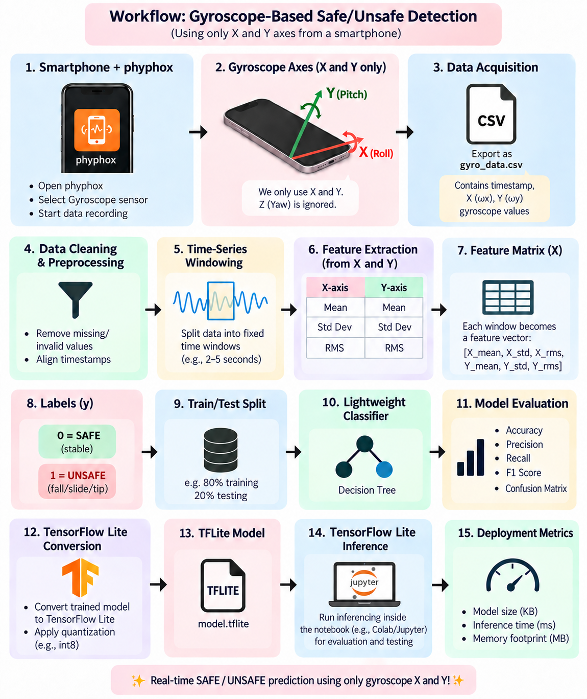

# TinyML Lab 1: Real-Time Rotational Dynamics & Edge-AI Payload Safety System

## Overview

This repository contains the complete implementation for **Lab 1** of the TinyML laboratory course.

The project builds an end-to-end, edge-oriented TinyML pipeline that classifies short windows of smartphone gyroscope data (**X and Y axes**, recorded with the **phyphox** app) as **SAFE (0)** or **UNSAFE / FALL / SLIDE / TIP (1)** for a payload undergoing rotational instability.

Two models are built on the same six statistical features extracted from gyroscope signals:

- a **Decision Tree** (scikit-learn) as the classical ML baseline, and
- a **compact Keras neural network**, which is converted to **TensorFlow Lite** (Float32 and Full INT8 post-training quantization).

Edge execution is **simulated with the TensorFlow Lite interpreter inside the notebook**. No physical deployment on a smartphone or microcontroller is performed.

> **Scope note:** this is a small proof-of-concept experiment, not a production benchmark. See [Experimental Scope and Limitations](#experimental-scope-and-limitations).

---

## Lab Objectives

1. **Sensor data acquisition:** record rotational dynamics with a smartphone IMU (gyroscope) via phyphox.
2. **Preprocessing & feature engineering:** use Gyroscope X and Y only, clean and validate the data, window the signal, and extract statistical features (mean, standard deviation, RMS).
3. **Window-size selection:** compare 3.0 s, 1.0 s, 0.5 s and 0.25 s windows (50% overlap) using class coverage, evaluation validity and balanced metrics.
4. **Lightweight classification:** train a Decision Tree baseline using a trial-aware train/test split.
5. **Edge optimization:** train a compact Keras network on the same features and convert it to TensorFlow Lite (Float32 and Full INT8 post-training quantization).
6. **Quantization investigation & validation:** analyze quantization parameters, tensor dtypes, weight storage, and file-size behavior across diagnostic and final implementations.
7. **Notebook-based benchmarking:** evaluate TFLite predictions, model size, memory reduction, and single-sample inference latency using the TFLite interpreter in the notebook.

---

## System Architecture & Workflow



Sequence implemented in the pipeline:

```
Smartphone + phyphox
        ↓
Gyroscope X/Y acquisition (one continuous recording)
        ↓
Data cleaning and preprocessing
        ↓
Trial segmentation (20 stopwatch-timed fall events)
        ↓
Window-size ablation (3.0 / 1.0 / 0.5 / 0.25 s, 50% overlap)
        ↓
Final windowing with the selected size (1.0 s, 50% overlap)
        ↓
Six statistical features (X/Y mean, std, RMS)
        ↓
SAFE / UNSAFE window labels
        ↓
Trial-aware train/test split (GroupShuffleSplit by trial)
        ↓
Decision Tree baseline
        ↓
Compact Keras neural network (6 → 128 → 64 → 32 → 1)
        ↓
Float32 TFLite Conversion
        ↓
Full INT8 post-training quantization (calibrated on training data)
        ↓
TFLite interpreter inference (in notebook)
        ↓
Latency / model-size / accuracy evaluation
```

---

## Dataset Description

- **File:** `Main_Raw Data.csv` (single continuous phyphox export).
- **Columns in the export:** `Time (s)`, `Gyroscope x (rad/s)`, `Gyroscope y (rad/s)`, `Gyroscope z (rad/s)`, `Absolute (rad/s)`.
- **Signals used:** only Gyroscope **X** and **Y**. Z is detected but is not used anywhere in the pipeline.
- **Size:** 35,846 raw samples over 71.669 s (about 500 Hz, median Δt ≈ 0.002 s).
- **Trials:** the gyroscope was never stopped between falls, so the 20 trials are 20 segments of one continuous signal. They are located by matching 20 independently recorded **stopwatch fall times** to the nearest gyroscope timestamp.
- **Segmentation:** each trial spans ±3.0 s around its fall time, clamped at the midpoint to neighbouring events so trials never overlap. This gives 34,761 samples across 20 trials. The segmentation is **fixed** and is independent of the ML window size, so only the window length changes during the ablation.
- **Data quality:** no missing values, no duplicate rows, no non-numeric entries were found.

---

## Preprocessing & Feature Engineering

Each window is described by six features computed from the gyroscope X and Y angular-velocity samples inside that window. These are the **only classifier inputs** for both the Decision Tree and the Keras network:

| Feature    | Description                       |
| ---------- | --------------------------------- |
| `X_mean` | Mean of gyroscope X in the window |
| `X_std`  | Standard deviation of gyroscope X |
| `X_rms`  | Root-mean-square of gyroscope X   |
| `Y_mean` | Mean of gyroscope Y in the window |
| `Y_std`  | Standard deviation of gyroscope Y |
| `Y_rms`  | Root-mean-square of gyroscope Y   |

The notebook also computes supplementary in-plane magnitude statistics (`omega_xy_*`), but they are **not** classifier inputs.

**Labels (window level):** a window whose end time is at or before its trial's recorded fall time is **SAFE (0)**. A window that reaches, crosses or follows the fall is **UNSAFE (1)**.

---

## Window Size Selection

A window-size ablation was run with **50% overlap** for every size. Features, labelling rule, trial segmentation, Decision Tree configuration (`max_depth = 5`) and the group-aware split method were identical across experiments, so window size was the only variable.

### Single documented split per window size (Decision Tree, test set)

| Window | Total windows | SAFE | UNSAFE | SAFE % | Usable trials | Train SAFE/UNSAFE | Test SAFE/UNSAFE | Accuracy | Balanced acc. | SAFE recall | UNSAFE recall | Precision (UNSAFE) | F1 (UNSAFE) |
| ------ | ------------: | ---: | -----: | -----: | ------------: | ----------------: | ---------------: | -------: | ------------: | ----------: | ------------: | -----------------: | ----------: |
| 3.0 s  |            18 |    2 |     16 |  11.1% |            16 |            1 / 13 |            1 / 3 |    75.0% |         50.0% |        0.0% |        100.0% |              75.0% |       0.857 |
| 1.0 s  |           111 |   41 |     70 |  36.9% |            20 |           33 / 57 |           8 / 13 |    71.4% |         72.1% |       75.0% |         69.2% |              81.8% |       0.750 |
| 0.5 s  |           249 |  113 |    136 |  45.4% |            20 |          90 / 111 |          23 / 25 |    77.1% |         76.6% |       65.2% |         88.0% |              73.3% |       0.800 |
| 0.25 s |           533 |  263 |    270 |  49.3% |            20 |         207 / 222 |          56 / 48 |    74.0% |         75.1% |       60.7% |         89.6% |              66.2% |       0.761 |

### Stability across valid group-aware splits

For each window size, up to 25 valid group-aware splits (both classes present in train and test; trial overlap = 0) were evaluated with the same Decision Tree:

| Window | Mean balanced accuracy ± std (25 splits) |
| ------ | ----------------------------------------- |
| 3.0 s  | 0.485 ± 0.041                            |
| 1.0 s  | 0.664 ± 0.110                            |
| 0.5 s  | 0.633 ± 0.101                            |
| 0.25 s | 0.632 ± 0.089                            |

### Selection

Based on the executed window-size ablation, **1.0 s windows with 50% overlap were selected for the final pipeline for this dataset and experimental setup.**

- **3.0 s** produced too few usable windows (18, with only 2 SAFE; 4 of 20 trials yielded no window). The test set had a single SAFE window, and the Decision Tree predicted UNSAFE for every test window (SAFE recall 0, balanced accuracy 0.5). Its accuracy is therefore not meaningful.
- **1.0 s, 0.5 s and 0.25 s** all made all 20 trials usable and gave valid two-class train and test sets.
- The multi-split balanced accuracies of these three are close relative to their split-to-split variability (std ≈ 0.09–0.11). The notebook's rule treats windows within 0.05 of the best multi-split mean balanced accuracy as tied and picks the **longest** tied window, which keeps the most temporal context per window. Accuracy was not used as the selection criterion.
- **0.5 s** scored higher than 1.0 s on the single documented split (balanced accuracy 0.766 vs 0.721), but this was not reflected in the multi-split mean, so it did not drive the selection.
- **0.25 s** gave substantially more windows but no clear performance advantage.

The multi-split results show considerable variability, so this choice is specific to this small dataset and setup. It should **not** be read as a universal or generalizable optimum.

---

## Final Dataset Configuration

| Item                     | Value                                                                                                      |
| ------------------------ | ---------------------------------------------------------------------------------------------------------- |
| Window size              | 1.0 s                                                                                                      |
| Overlap                  | 50% (step = 0.5 s)                                                                                         |
| Usable trials            | 20 of 20                                                                                                   |
| Total windows            | 111                                                                                                        |
| SAFE / UNSAFE windows    | 41 (36.9%) / 70 (63.1%)                                                                                    |
| Split method             | `GroupShuffleSplit`, `groups = trial_id`, `test_size = 0.2`                                          |
| Split seed               | 42 (first seed giving both classes in train and test; chosen by class presence only, never by model score) |
| Training set             | 16 trials, 90 windows (SAFE 33 / UNSAFE 57)                                                                |
| Test set                 | 4 trials, 21 windows (SAFE 8 / UNSAFE 13)                                                                  |
| Train/test trial overlap | 0 (verified; no train window overlaps a test window in time)                                               |

Because consecutive windows overlap by 50%, windows are **never** split individually. All windows of a trial stay together in train or in test.

---

## Models

### Decision Tree Baseline

- scikit-learn `DecisionTreeClassifier(max_depth=5, random_state=42)`, input: the six features above.
- Fitted tree: depth 5, 10 leaves, 19 nodes.
- This is the **classical baseline**. It is **not** converted to TensorFlow Lite (a scikit-learn tree cannot be directly converted).

### Neural Network (Final Model)

A compact TensorFlow/Keras neural network, trained on the same six features, is the model used for TFLite conversion.

```
Input (6 features, standardized)
  → Dense(128, ReLU)
  → Dense(64, ReLU)
  → Dense(32, ReLU)
  → Dense(1, Sigmoid)
```

- **Parameters:** 11,265 trainable parameters.
- **Optimizer:** Adam; **Loss:** binary cross-entropy.
- **Training schedule:** 50 epochs, batch size 16.
- **Feature preprocessing:** Features are standardized with a `StandardScaler` **fitted on the training set only**; its parameters are saved to `outputs/models/feature_scaler.json` and reused during TFLite inference.
- **Validation monitoring:** The test set is passed as `validation_data` strictly to monitor the training curve (no early stopping, checkpointing or hyperparameter tuning was done on the test set).
- **Final training accuracy:** 0.8667 (86.67%).

---

## Quantization Investigation & Technical Study

To ensure complete experimental rigor and academic transparency, the repository documents both the diagnostic quantization investigation and the final corrected implementation across two complementary notebooks.

### 1. Initial Quantization Observation
The initial prototype implementation utilized a minimal toy neural network:
```
6 → 16 → 8 → 1  (~265 trainable parameters)
```
After training on the six statistical features, the model was converted to both Float32 and Full INT8 TensorFlow Lite formats. The resulting file sizes were:
- **Float32 TFLite:** `3,468 bytes` (3.39 KB)
- **Full INT8 TFLite:** `3,696 bytes` (3.61 KB)
- **Observed Difference:** `+228 bytes` (+6.57% file-size increase)

This outcome initially appeared counter-intuitive: post-training INT8 quantization typically reduces model footprint by replacing 32-bit floating-point weights with 8-bit integers, expecting an approximate 50–75% reduction in model size.

### 2. Diagnostic Investigation
To identify the root cause of this behavior, a dedicated diagnostic investigation was executed in [`2548560_Tejas_R_M_TinyML_LAB01_experimentation.ipynb`](file:///c:/Users/hp/Desktop/all%20folders/Msc/Trimster%205/Tiny%20ML/Lab01/2548560_Tejas_R_M_TinyML_LAB01_experimentation.ipynb). The investigation systematically tested multiple hypotheses:
- *Did quantization fail silently or fall back to dynamic range quantization?*
- *Were any Float32 tensors left unquantized in the computation graph?*
- *Was an incorrect or stale model file measured?*
- *Was there an error in the file-size measurement or serialization pipeline?*
- *Or was the model simply too small for total FlatBuffer size to benefit from quantization?*

Using `tf.lite.Interpreter` tensor details and schema inspection, the notebook verified:
- **Full INT8 verification:** `PASS` (`int8_is_full_integer = True`).
- **Tensor dtypes:** Exactly 11 tensors were present in the INT8 model: **8 INT8 tensors** (inputs, intermediate activations, outputs, and kernel weights), **3 INT32 tensors** (bias vectors), and **0 Float32 tensors**.
- **Quantization parameters:** Per-tensor scales and zero-points were fully populated (input scale `0.0319812`, zero-point `-27`; output scale `0.00390625`, zero-point `-128`).
- **File integrity:** Verified that the correct model files were being generated, loaded, and measured with no script or caching errors.

### 3. Weight Quantization Actually Reduced Storage
Although the *total* `.tflite` file size increased, detailed tensor payload inspection proved that the **weights themselves were successfully quantized and shrunk**:
- **Float32 kernel weight payload:** `928 bytes`
- **INT8 kernel weight payload:** `232 bytes`
- **Kernel weight savings:** **75.0% reduction** (`−696 bytes`)
- **Combined weights + biases payload:**
  - Float32: `1,028 bytes`
  - INT8: `332 bytes`
  - Net savings: `−696 bytes`

This confirmed that TensorFlow Lite's integer quantization math and weight compression operated with 100% correctness.

### 4. Why Did the Total File Size Increase?
In an ultra-small network (265 parameters), raw weights account for only a minor fraction of the total TFLite FlatBuffer. The remainder of the file stores structural model representation data, including:
- FlatBuffer schema headers and subgraph descriptors,
- Operator registration tables,
- Per-tensor quantization metadata (scale multipliers, zero-point offsets, quantization dimension information).

By decomposing the total file into weight payload versus non-weight representation content:
- **Float32 Model:** `3,468 B total` − `1,028 B weights/biases` = **2,440 bytes non-weight content** (70.4% of total file).
- **INT8 Model:** `3,696 B total` − `332 B weights/biases` = **3,364 bytes non-weight content** (91.0% of total file).
- **Non-weight overhead increase:** **+924 bytes**.

Because the non-weight representation and quantization metadata overhead added **+924 bytes**, it outweighed the **696 bytes** saved by quantizing the weights and biases, resulting in a net file-size increase of **+228 bytes** (3,696 B vs 3,468 B).

### 5. Key Findings
> **Core Principle:** Quantization can successfully reduce the storage required for model weights without necessarily reducing the total `.tflite` file size when the neural network is extremely small.

- For sub-kilobyte models, fixed FlatBuffer representation and quantization-related metadata can dominate the overall file size.
- Total file-size reduction becomes measurable and significant when the neural network contains enough parameters for weight storage to dominate over fixed serialization overhead.
- INT8 quantization was never ineffective; the initial architecture was simply too small for whole-file compression to emerge.

### 6. Corrected Final Implementation
To allow the benefits of INT8 quantization to materialize clearly at the file level while preserving a lean TinyML profile, the final neural network capacity was scaled to:
```
6 → 128 → 64 → 32 → 1  (11,265 trainable parameters)
```
In this model, the weight payload accounts for the vast majority of the file, allowing 8-bit weight compression to heavily dominate the fixed FlatBuffer overhead:
- **Float32 TFLite (`model_float32.tflite`):** `47,824 bytes` (**46.70 KB**)
- **Full INT8 TFLite (`model_int8.tflite`):** `20,488 bytes` (**20.01 KB**)
- **Total Memory Footprint Reduction:** **57.16% reduction** (`27,336 bytes` saved)

### 7. Comparative Technical Summary

| Attribute | Diagnostic Model (`..._experimentation.ipynb`) | Final Corrected Model (`..._LAB01.ipynb`) |
|---|---|---|
| **Architecture** | `6 → 16 → 8 → 1` | `6 → 128 → 64 → 32 → 1` |
| **Trainable Parameters** | 265 | 11,265 |
| **Float32 TFLite Size** | 3.39 KB (3,468 B) | 46.70 KB (47,824 B) |
| **Full INT8 TFLite Size** | 3.61 KB (3,696 B) | 20.01 KB (20,488 B) |
| **Weight Payload Change** | **−75.0%** (−696 B) | **−75.0%** |
| **Total File Size Change** | **+6.57%** (+228 B) *(metadata dominated)* | **−57.16%** (−27,336 B) *(weight savings dominated)* |
| **Quantization Verification** | PASS (Full INT8) | PASS (Full INT8) |
| **Test Accuracy** | 71.43% | 76.19% |

The initial result was neither a failure of quantization nor a measurement error—it was a natural manifestation of FlatBuffer metadata scaling in sub-kilobyte neural networks. The final model resolves this and demonstrates textbook TinyML post-training quantization compression.

---

## TensorFlow Lite Conversion

The trained Keras model is converted using `tf.lite.TFLiteConverter.from_keras_model`.

### Float32 Model (`model_float32.tflite`)

- Standard Float32 conversion with default optimizations.
- File size: **47,824 bytes (46.70 KB)**.

### Full INT8 Quantized Model (`model_int8.tflite`)

- Post-training **full-integer quantization** of the same trained Keras model.
- Converter settings: `tf.lite.Optimize.DEFAULT`, `tf.lite.OpsSet.TFLITE_BUILTINS_INT8`, with `int8` input and output inference types.
- **Representative dataset:** Calibrated strictly on the 90 **training** feature samples (test data are never used for calibration).
- **Measured tensor details:**
  - Input tensor: `dtype=int8`, `scale=0.0319812`, `zero_point=-27`
  - Output tensor: `dtype=int8`, `scale=0.00390625`, `zero_point=-128`
- File size: **20,488 bytes (20.01 KB)**.
- **Memory reduction:** **57.16% reduction** (27,336 bytes saved).

### TFLite Interpreter Inference

Both `.tflite` models are loaded with `tf.lite.Interpreter` and evaluated on the held-out test set (21 windows), one sample at a time, inside the notebook.

- Inputs are standardized with the saved training-set scaler and mapped to integer space using the input tensor's `scale` and `zero_point`.
- Outputs are dequantized using the output tensor's quantization parameters and thresholded at 0.5.
- Edge execution is **simulated** in the notebook environment.

---

## Evaluation

All metrics below are computed on the held-out test set (21 windows: 8 SAFE, 13 UNSAFE). UNSAFE is the positive class for precision, recall, and F1. SAFE recall represents the true-negative rate.

**Balanced accuracy** is the mean of SAFE recall and UNSAFE recall.

| Model                                  | Size (KB) | Accuracy | Balanced Acc. | Precision (UNSAFE) | UNSAFE Recall | SAFE Recall | F1-Score | Confusion Matrix (TN / FP / FN / TP) |
| -------------------------------------- | --------: | -------: | ------------: | -----------------: | ------------: | ----------: | -------: | ------------------------------------ |
| **Decision Tree Baseline**       |        — |   0.7143 |        0.7212 |             0.8182 |        0.6923 |      0.7500 |   0.7500 | 6 / 2 / 4 / 9                        |
| **Keras Neural Network (Float)** |        — |   0.7143 |        0.7212 |             0.8182 |        0.6923 |      0.7500 |   0.7500 | 6 / 2 / 4 / 9                        |
| **TFLite Float32**               |  46.70 KB |   0.7143 |        0.7212 |             0.8182 |        0.6923 |      0.7500 |   0.7500 | 6 / 2 / 4 / 9                        |
| **TFLite Full INT8**             |  20.01 KB |   0.7619 |        0.7596 |             0.8333 |        0.7692 |      0.7500 |   0.8000 | 6 / 2 / 3 / 10                       |

### Quantization Fidelity & Agreement

- **Float32 TFLite vs Keras:** 100.0% prediction agreement.
- **INT8 TFLite vs Keras:** 95.24% prediction agreement (20 of 21 test samples agreed).
- **Maximum absolute probability difference:** 0.0275.
- INT8 quantization preserved all true-negative SAFE detections (6/8) while correctly detecting an additional UNSAFE window (10/13 vs 9/13), yielding a test accuracy of 76.19%.

### Notebook-Based Latency Benchmark

Single-sample inference latency measured in the notebook CPU environment (200 timed iterations after 20 warm-up runs):

| Model                      | Size (KB) |   Mean Latency (ms) | Median Latency (ms) |
| -------------------------- | --------: | ------------------: | ------------------: |
| **Float32 TFLite**   |  46.70 KB | 0.0061 ms (6.1 µs) | 0.0047 ms (4.7 µs) |
| **Full INT8 TFLite** |  20.01 KB | 0.0053 ms (5.3 µs) | 0.0048 ms (4.8 µs) |

*Note: In the notebook environment, execution time is dominated by Python interpreter dispatch overhead. On dedicated microcontrollers (e.g., ARM Cortex-M), integer arithmetic delivers hardware-level cycle and energy savings.*

---

## Experimental Scope and Limitations

- **All 20 physical trials contain a failure event.** There are no independently recorded SAFE trials. SAFE and UNSAFE are assigned at the **window level** around each recorded fall, so the task is closer to *pre-failure vs failure-window* classification than to *SAFE-trial vs UNSAFE-trial* classification.
- **The dataset is small** (20 trials from one continuous recording session). Drift, mounting effects or handling artefacts of that session affect every trial.
- **Fall times were recorded with a manual stopwatch** and matched to the nearest gyroscope timestamp, which introduces an unquantified timing offset in the labels.
- **Overlapping windows are not independent experiments.** Windows from the same trial are strongly correlated, so the number of windows overstates the amount of independent evidence. Trial-aware splitting is therefore essential. Shorter windows create more windows, not more independent trials.
- **The test set is small** (4 trials, 21 windows at 1.0 s), and the multi-split results show large variability. Single-split metrics should be read as indicative only.
- No samples were duplicated or synthesised, and no sensor values or labels were altered.
- The results are a **proof-of-concept** and should not be interpreted as production-level or real-world generalization.

---

## Repository Structure (Branch: `Lab-1`)

```
├── 2548560_Tejas_R_M_TinyML_LAB01.ipynb                    # Final corrected implementation notebook
├── 2548560_Tejas_R_M_TinyML_LAB01_experimentation.ipynb      # Diagnostic & quantization investigation notebook
├── Main_Raw Data.csv                                         # Raw continuous gyroscope dataset
├── model_float32.tflite                                      # Final Float32 TFLite model (46.70 KB)
├── model_int8.tflite                                         # Final Full INT8 TFLite model (20.01 KB)
├── Workflow.png                                              # Pipeline workflow diagram
└── README.md                                                 # Project documentation and results
```

---

## Requirements & Prerequisites

```bash
pip install numpy pandas matplotlib seaborn scikit-learn tensorflow
```

---

## How to Run

1. Clone or checkout the `Lab-1` branch:

```bash
git clone -b Lab-1 https://github.com/Tejas2913/TinyML-Lab-2548560.git
```

2. Open the final implementation notebook:

```bash
jupyter notebook 2548560_Tejas_R_M_TinyML_LAB01.ipynb
```

3. Ensure `Main_Raw Data.csv` is available at `dataset/raw/Main_Raw Data.csv` (or in the root folder).
4. Run all cells sequentially. The notebook executes data validation, ablation, training, Float32/INT8 TFLite conversion, and interpreter benchmarks, saving models and summary reports to `outputs/`.
5. To explore the diagnostic quantization analysis, open `2548560_Tejas_R_M_TinyML_LAB01_experimentation.ipynb`.
